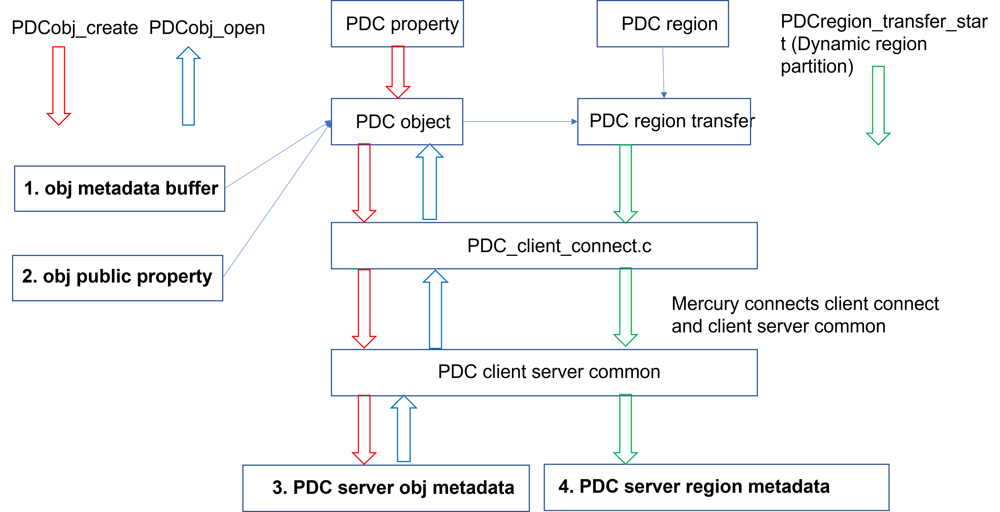
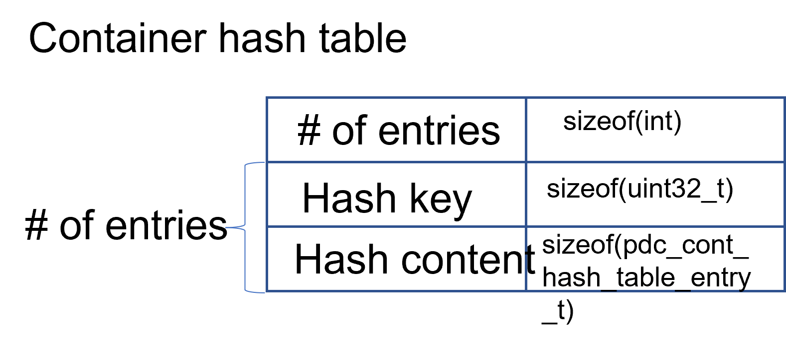
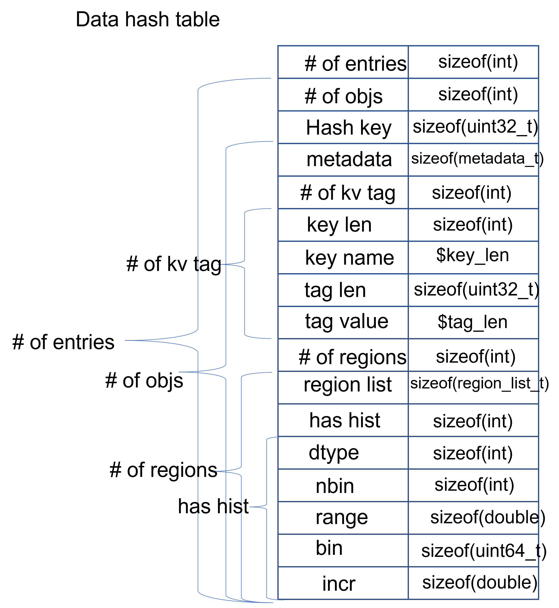
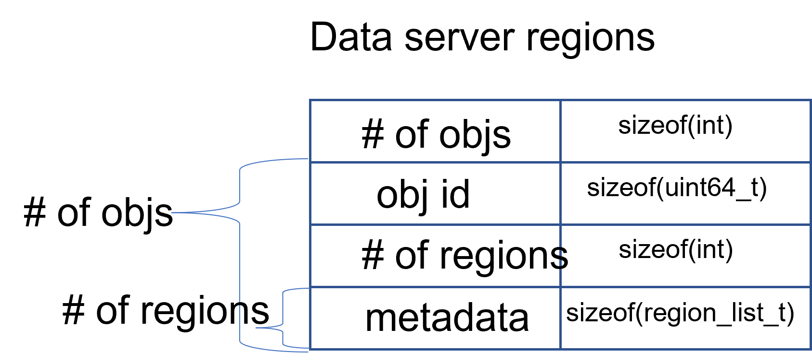
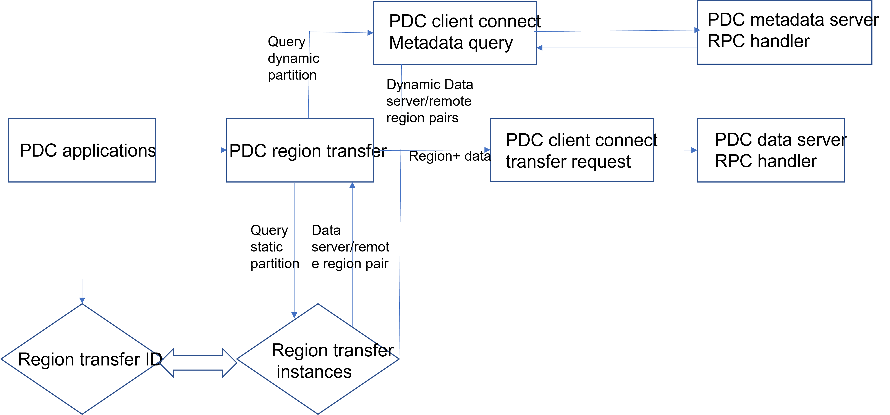

# PDC Documentations
- [PDC Documentations](#pdc-documentations)
- [PDC user APIs](#pdc-user-apis)
  - [PDC general APIs](#pdc-general-apis)
  - [PDC container APIs](#pdc-container-apis)
  - [PDC object APIs](#pdc-object-apis)
  - [PDC region APIs](#pdc-region-apis)
  - [PDC property APIs](#pdc-property-apis)
  - [PDC query APIs](#pdc-query-apis)
  - [PDC hist APIs](#pdc-hist-apis)
- [PDC Data types](#pdc-data-types)
  - [Basic types](#basic-types)
  - [region transfer partition type](#region-transfer-partition-type)
  - [Object consistency semantics type](#object-consistency-semantics-type)
  - [Histogram structure](#histogram-structure)
  - [Container info](#container-info)
  - [Container life time](#container-life-time)
  - [Object property public](#object-property-public)
  - [Object property](#object-property)
  - [Object info](#object-info)
  - [Object structure](#object-structure)
  - [Region info](#region-info)
  - [Access type](#access-type)
  - [Transfer request status](#transfer-request-status)
  - [Query operators](#query-operators)
  - [Query structures](#query-structures)
  - [Selection structure](#selection-structure)
- [Developers notes](#developers-notes)
  - [How to implement an RPC from client to server](#how-to-implement-an-rpc-from-client-to-server)
  - [PDC Server metadata overview](#pdc-server-metadata-overview)
    - [PDC metadata structure](#pdc-metadata-structure)
    - [Metadata operations at client side](#metadata-operations-at-client-side)
  - [PDC metadata management strategy](#pdc-metadata-management-strategy)
    - [Managing metadata and data by the same server](#managing-metadata-and-data-by-the-same-server)
    - [Separate metadata server from data server](#separate-metadata-server-from-data-server)
    - [Static object region mappings](#static-object-region-mappings)
    - [Dynamic object region mappings](#dynamic-object-region-mappings)
  - [PDC metadata management implementation](#pdc-metadata-management-implementation)
    - [Create metadata](#create-metadata)
    - [Binding metadata to object](#binding-metadata-to-object)
    - [Register object metadata at metadata server](#register-object-metadata-at-metadata-server)
    - [Retrieve metadata from metadata server](#retrieve-metadata-from-metadata-server)
    - [Object metadata at client](#object-metadata-at-client)
    - [Metadata at data server](#metadata-at-data-server)
    - [Object metadata update](#object-metadata-update)
    - [Object region metadata](#object-region-metadata)
    - [Metadata checkpoint](#metadata-checkpoint)
  - [Region transfer request at client](#region-transfer-request-at-client)
    - [Region transfer request create and close](#region-transfer-request-create-and-close)
    - [Region transfer request start](#region-transfer-request-start)
    - [Region transfer request wait](#region-transfer-request-wait)
  - [Region transfer request at server](#region-transfer-request-at-server)
  - [Server region transfer request RPC](#server-region-transfer-request-rpc)
    - [Server nonblocking control](#server-nonblocking-control)
    - [Server region transfer request start](#server-region-transfer-request-start)
    - [Server region transfer request wait](#server-region-transfer-request-wait)
  - [Server region storage](#server-region-storage)
    - [Storage by file offset](#storage-by-file-offset)
    - [Storage by region](#storage-by-region)
  - [Open tasks for PDC](#open-tasks-for-pdc)
    - [Replacing individual modules with efficient Hash table data structures](#replacing-individual-modules-with-efficient-hash-table-data-structures)
    - [Restarting pdc\_server.exe with different numbers of servers](#restarting-pdc_serverexe-with-different-numbers-of-servers)
    - [Fast region search mechanisms](#fast-region-search-mechanisms)
    - [Merge overlapping regions](#merge-overlapping-regions)
# PDC user APIs
  ## PDC general APIs
  + pdcid_t PDCinit(const char *pdc_name)
    - Input: 
      + pdc_name is the reference for PDC class. Recommended use "pdc"
    - Output: 
      + PDC class ID used for future reference.
    - All PDC client applications must call PDCinit before using it. This function will setup connections from clients to servers. A valid PDC server must be running.
    - For developers: currently implemented in pdc.c.
  + perr_t PDCclose(pdcid_t pdcid)
    - Input: 
      + PDC class ID returned from PDCinit.
    - Ouput: 
      + SUCCEED if no error, otherwise FAIL.
    - This is a proper way to end a client-server connection for PDC. A PDCinit must correspond to one PDCclose.
    - For developers: currently implemented in pdc.c.
  + perr_t PDC_Client_close_all_server()
    - Ouput: 
      + SUCCEED if no error, otherwise FAIL.
    - Close all PDC servers that running.
    - For developers: see PDC_client_connect.c
  ## PDC container APIs
  + pdcid_t PDCcont_create(const char *cont_name, pdcid_t cont_prop_id)
    - Input: 
      + cont_name: the name of container. e.g "c1", "c2"
      + cont_prop_id: property ID for inheriting a PDC property for container.
    - Output: pdc_id for future referencing of this container, returned from PDC servers.
    - Create a PDC container for future use. 
    - For developers: currently implemented in pdc_cont.c. This function will send a name to server and receive an container id. This function will allocate necessary memories and initialize properties for a container.
  + pdcid_t PDCcont_create_col(const char *cont_name, pdcid_t cont_prop_id)
    - Input: 
      + cont_name: the name to be assigned to a container. e.g "c1", "c2"
      + cont_prop_id: property ID for inheriting a PDC property for container.
    - Output: pdc_id for future referencing.
    - Exactly the same as PDCcont_create, except all processes must call this function collectively. Create a PDC container for future use collectively.
    - For developers: currently implemented in pdc_cont.c.
  + pdcid_t PDCcont_open(const char *cont_name, pdcid_t pdc)
    - Input: 
      + cont_name: the name of container used for PDCcont_create.
      + pdc: PDC class ID returned from PDCinit.
    - Output:
      + error code. FAIL OR SUCCEED
    - Open a container. Must make sure a container named cont_name is properly created (registered by PDCcont_create at remote servers).
    - For developers: currently implemented in pdc_cont.c. This function will make sure the metadata for a container is returned from servers. For collective operations, rank 0 is going to broadcast this metadata ID to the rest of processes. A struct _pdc_cont_info is created locally for future reference.
  + perr_t PDCcont_close(pdcid_t id)
    - Input: 
      + container ID, returned from PDCcont_create.
    - Output: 
      + error code, SUCCEED or FAIL.
    - Correspond to PDCcont_open. Must be called only once when a container is no longer used in the future.
    - For developers: currently implemented in pdc_cont.c. The reference counter of a container is decremented. When the counter reaches zero, the memory of the container can be freed later.
  + struct pdc_cont_info *PDCcont_get_info(const char *cont_name)
     - Input: 
       + name of the container
     - Output: 
       + Pointer to a new structure that contains the container information [See container info](#container-info)
     - Get container information
     - For developers: See pdc_cont.c. Use name to search for pdc_id first by linked list lookup. Make a copy of the metadata to the newly malloced structure.
  + perr_t PDCcont_persist(pdcid_t cont_id)
    - Input:
      + cont_id: container ID, returned from PDCcont_create.
    - Output: 
      + error code, SUCCEED or FAIL.
    - Make a PDC container persist.
    - For developers, see pdc_cont.c. Set the container life field PDC_PERSIST.
  + perr_t PDCprop_set_cont_lifetime(pdcid_t cont_prop, pdc_lifetime_t cont_lifetime)
    - Input:
      + cont_prop: Container property pdc_id
      + cont_lifetime: See [container life time](#container-life-time)
    - Output: 
      + error code, SUCCEED or FAIL.
    - Set container life time for a property.
    - For developers, see pdc_cont.c.
  + pdcid_t PDCcont_get_id(const char *cont_name, pdcid_t pdc_id)
    - Input:
      + cont_name: Name of the container
      + pdc_id: PDC class ID, returned by PDCinit
    - Output: 
      + container ID
    - Get container ID by name. This function is similar to open.
    - For developers, see pdc_client_connect.c. It will query the servers for container information and create a container structure locally.
  + perr_t PDCcont_del(pdcid_t cont_id)
    - Input:
      + cont_id: container ID, returned from PDCcont_create.
    - Output: 
      + error code, SUCCEED or FAIL.
    - Deleta a container
    - For developers: see pdc_client_connect.c. Need to send RPCs to servers for metadata update.
  + perr_t PDCcont_put_tag(pdcid_t cont_id, char *tag_name, void *tag_value, psize_t value_size)
    - Input:
      + cont_id: Container ID, returned from PDCcont_create.
      + tag_name: Name of the tag
      + tag_value: Value to be written under the tag
      + value_size: Number of bytes for the tag_value (tag_size may be more informative)
    - Output: 
      + error code, SUCCEED or FAIL.
    - Record a tag_value under the name tag_name for the container referenced by cont_id.
    - For developers: see pdc_client_connect.c. Need to send RPCs to servers for metadata update.
  + perr_t PDCcont_get_tag(pdcid_t cont_id, char *tag_name, void **tag_value, psize_t *value_size)
    - Input:
      + cont_id: Container ID, returned from PDCcont_create.
      + tag_name: Name of the tag
      + value_size: Number of bytes for the tag_value (tag_size may be more informative)
    - Output:
      + tag_value: Pointer to the value to be read under the tag
      + error code, SUCCEED or FAIL.
    - Retrieve a tag value to the memory space pointed by the tag_value under the name tag_name for the container referenced by cont_id.
    - For developers: see pdc_client_connect.c. Need to send RPCs to servers for metadata retrival.
  + perr_t PDCcont_del_tag(pdcid_t cont_id, char *tag_name)
    - Input:
      + cont_id: Container ID, returned from PDCcont_create.
      + tag_name: Name of the tag
    - Output: 
      + error code, SUCCEED or FAIL.
    - Delete a tag for a container by name
    - For developers: see pdc_client_connect.c. Need to send RPCs to servers for metadata update.
  + perr_t PDCcont_put_objids(pdcid_t cont_id, int nobj, pdcid_t *obj_ids)
    - Input:
      + cont_id: Container ID, returned from PDCcont_create.
      + nobj: Number of objects to be written
      + obj_ids: Pointers to the object IDs
    - Output: 
      + error code, SUCCEED or FAIL.
    - Put an array of objects to a container.
    - For developers: see pdc_client_connect.c. Need to send RPCs to servers for metadata update.
  + perr_t PDCcont_get_objids(pdcid_t cont_id ATTRIBUTE(unused), int *nobj ATTRIBUTE(unused), pdcid_t **obj_ids ATTRIBUTE(unused) )
     TODO:
  + perr_t PDCcont_del_objids(pdcid_t cont_id, int nobj, pdcid_t *obj_ids)
    - Input:
      + cont_id: Container ID, returned from PDCcont_create.
      + nobj: Number of objects to be deleted
      + obj_ids: Pointers to the object IDs
    - Output: 
      + error code, SUCCEED or FAIL.
    - Delete an array of objects to a container.
    - For developers: see pdc_client_connect.c. Need to send RPCs to servers for metadata update.
  ## PDC object APIs
  + pdcid_t PDCobj_create(pdcid_t cont_id, const char *obj_name, pdcid_t obj_prop_id)
    - Input:
      + cont_id: Container ID, returned from PDCcont_create.
      + obj_name: Name of objects to be created
      + obj_prop_id: Property ID to be inherited from.
    - Output: 
      + Local object ID
    - Create a PDC object.
    - For developers: see pdc_obj.c. This process need to send the name of the object to be created to the servers. Then it will receive an object ID. The object structure will inherit attributes from its container and  input object properties.
  + PDCobj_create_mpi(pdcid_t cont_id, const char *obj_name, pdcid_t obj_prop_id, int rank_id, MPI_Comm comm)
    - Input:
      + cont_id: Container ID, returned from PDCcont_create.
      + obj_name: Name of objects to be created
      + rank_id: Which rank ID the object is placed to
      + comm: MPI communicator for the rank_id
    - Output: 
      + Local object ID
    - Create a PDC object at the rank_id in the communicator comm. Object is created based on the arguments provided by the process with rank_id. This function is a colllective operation. All MPI processes must call this function together.
    - For developers: see pdc_mpi.c.
  + pdcid_t PDCobj_open(const char *obj_name, pdcid_t pdc)
    - Input:
      + obj_name: Name of objects to be created
      + pdc: PDC class ID, returned from PDCInit
    - Output: 
      + Local object ID
    - Open a PDC ID created previously by name.
    - For developers: see pdc_obj.c. Need to communicate with servers for metadata of the object.
  + pdcid_t PDCobj_open_col(const char *obj_name, pdcid_t pdc)
    - Input:
      + obj_name: Name of objects to be created, only rank 0 need to provide a value.
      + pdc: PDC class ID, returned from PDCInit
    - Output: 
      + Local object ID
    - Open a PDC ID created previously by name collectively. All MPI processes must call this function together.
    - For developers: see pdc_obj.c. Need to communicate with servers for metadata of the object.
  + perr_t PDCobj_close(pdcid_t obj_id)
    - Input:
      + obj_id: Local object ID to be closed.
    - Output:
      + error code, SUCCEED or FAIL.
    - Close an object. Must do this after open an object.
    - For developers: see pdc_obj.c. Dereference an object by reducing its reference counter.
  + struct pdc_obj_info *PDCobj_get_info(pdcid_t obj)
    - Input:
      + obj_name: Local object ID
    - Output:
      + object information see [object information](#object-info)
    - Get a pointer to a structure that describes the object metadata.
    - For developers: see pdc_obj.c. Pull out local object metadata by ID.
  + pdcid_t PDCobj_put_data(const char *obj_name, void *data, uint64_t size, pdcid_t cont_id)
    - Input:
      + obj_name: Name of object
      + data: Pointer to data memory
      + size: Size of data
      + cont_id: Container ID of this object
    - Output:
      + Local object ID created locally with the input name
    - Write data to an object.
    - For developers: see pdc_client_connect.c. Nedd to send RPCs to servers for this request. (TODO: change return value to perr_t)
  + perr_t PDCobj_get_data(pdcid_t obj_id, void *data, uint64_t size)
    - Input:
      + obj_id: Local object ID
      + size: Size of data
    - Output:
      + data: Pointer to data to be filled
      + error code, SUCCEED or FAIL.
    - Read data from an object.
    - For developers: see pdc_client_connect.c. Use PDC_obj_get_info to retrieve name. Then forward name to servers to fulfill requests.
  + perr_t PDCobj_del_data(pdcid_t obj_id)
    - Input:
      + obj_id: Local object ID
    - Output:
      + error code, SUCCEED or FAIL.
    - Delete data from an object.
    - For developers: see pdc_client_connect.c. Use PDC_obj_get_info to retrieve name. Then forward name to servers to fulfill requests.
  + perr_t PDCobj_put_tag(pdcid_t obj_id, char *tag_name, void *tag_value, psize_t value_size)
    - Input:
      + obj_id: Local object ID
      + tag_name: Name of the tag to be entered
      + tag_value: Value of the tag
      + value_size: Number of bytes for the tag_value
    - Output:
      + error code, SUCCEED or FAIL.
    - Set the tag value for a tag
    - For developers: see pdc_client_connect.c. Need to use PDC_add_kvtag to submit RPCs to the servers for metadata update.
  + perr_t PDCobj_get_tag(pdcid_t obj_id, char *tag_name, void **tag_value, psize_t *value_size)
    - Input:
      + obj_id: Local object ID
      + tag_name: Name of the tag to be entered
    - Output:
      + tag_value: Value of the tag
      + value_size: Number of bytes for the tag_value
      + error code, SUCCEED or FAIL.
    - Get the tag value for a tag
    - For developers: see pdc_client_connect.c. Need to use PDC_get_kvtag to submit RPCs to the servers for metadata update.
  + perr_t PDCobj_del_tag(pdcid_t obj_id, char *tag_name)
    - Input:
      + obj_id: Local object ID
      + tag_name: Name of the tag to be entered
    - Output:
      + error code, SUCCEED or FAIL.
    - Delete a tag.
    - For developers: see pdc_client_connect.c. Need to use PDCtag_delete to submit RPCs to the servers for metadata update.
  + perr_t PDCobj_flush_start(pdcid_t obj_id)
    - Input:
      + obj_id: Local object ID
    - Output:
      + error code, SUCCEED or FAIL.
    - Flush an object server cache data. This function is a dummy function if server cache is not enabled.
    - For developers: pdc_obj.c. Start a RPC for each of the data servers to flush the input object.
  + perr_t PDCobj_flush_start()
    - Output:
      + error code, SUCCEED or FAIL.
    - Flush all objects' server cache data. This function is a dummy function if server cache is not enabled.
    - For developers: pdc_obj.c. Start a RPC for each of the data servers to flush all objects.
  + perr_t PDCobj_set_dims(pdcid_t obj_id, int ndim, uint64_t *dims)
    - Input:
      + obj_id: Local object ID
      + ndim: Number of dimensions. (must be the same as the object dimension set previously)
      + dims: Dimension array that has the size of ndim.
    - Output:
      + error code, SUCCEED or FAIL.
    - Reset object dimension. In general, it is recommended to set an object's property before creating the object. However, this function allows users to enlarge or shrink an object's dimension. The motivation is to cover the functionality of H5Dset_extent.
    - For developers: pdc_obj.c. Start a RPC and send the updated dimensions to metadata server. In addition, local memory is updated accordingly. There is no need to send the update for data server because every time a request submitted to the data server will include the up-to-dated object dimension information.
  + perr_t PDCobj_get_dims(pdcid_t obj_id, int *ndim, uint64_t **dims)
    - Input:
      + obj_id: Local object ID
    - Output:
      + ndim: Number of dimensions. (must be the same as the object dimension set previously)
      + dims: Dimension array that has the size of ndim.
      + error code, SUCCEED or FAIL.
    - Get object dimension dynamically. This operation allows users to query an object's dimension, in case PDCobj_set_dims is called on this object previously.
    - For developers: pdc_obj.c. Start a RPC and retrieve object dimensions from metadata server. In addition, local memory is updated accordingly.
  ## PDC region APIs
  + pdcid_t PDCregion_create(psize_t ndims, uint64_t *offset, uint64_t *size)
    - Input:
      + ndims: Number of dimensions
      + offset: Array of offsets
      + size: Array of offset length
    - Output:
      + Region ID
    - Create a region with ndims offset/length pairs
    - For developers: see pdc_region.c. Need to use PDC_get_kvtag to submit RPCs to the servers for metadata update.
  + perr_t PDCregion_close(pdcid_t region_id)
    - Input:
      + region_id: PDC ID returned from PDCregion_create
    - Output:
      + None
    - Close a PDC region
    - For developers: see pdc_region.c. Free offset and size arrays.
  + (deprecated) perr_t PDCbuf_obj_map(void *buf, pdc_var_type_t local_type, pdcid_t local_reg, pdcid_t remote_obj, pdcid_t remote_reg)
    - Input:
      + buf: Memory buffer
      + local_type: one of PDC basic types, see [PDC basic types](#basic-types)
      + local_reg: Local region ID
      + remote_obj: Remote object ID
      + remote_reg: Remote region ID
    - Output:
      + Region ID
    - Create a region with ndims offset/length pairs. At this stage of PDC development, the buffer has to be filled if you are performing PDC_WRITE with lock and release functions.
    - For developers: see pdc_region.c. Need to use PDC_get_kvtag to submit RPCs to the servers for metadata update.
  + (deprecated) perr_t PDCbuf_obj_unmap(pdcid_t remote_obj_id, pdcid_t remote_reg_id)
    - Input:
      + remote_obj_id: remote object ID
      + remote_reg_id: remote region ID
    - Output:
      + error code, SUCCEED or FAIL.
    - Unmap a region to the user buffer. PDCbuf_obj_map must be called previously.
    - For developers: see pdc_region.c.
  + (deprecated) perr_t PDCreg_obtain_lock(pdcid_t obj_id, pdcid_t reg_id, pdc_access_t access_type, pdc_lock_mode_t lock_mode)
    - Input:
      + obj_id: local object ID
      + reg_id: remote region ID
      + access_type: [PDC access type](#access-type)
      + lock_mode:  PDC_BLOCK or PDC_NOBLOCK
    - Output:
      + error code, SUCCEED or FAIL.
    - Obtain the lock to access a region in an object.
    - For developers: see pdc_region.c.
  + (deprecated) perr_t PDCreg_release_lock(pdcid_t obj_id, pdcid_t reg_id, pdc_access_t access_type)
    - Input:
      + obj_id: local object ID
      + reg_id: remote region ID
      + access_type: [PDC access type](#access-type)
    - Output:
      + error code, SUCCESS or FAIL.
    - Release the lock to access a region in an object. PDC_READ data is available after this lock release.
    - For developers: see pdc_region.c.
  + pdcid_t PDCregion_transfer_create(void *buf, pdc_access_t access_type, pdcid_t obj_id, pdcid_t local_reg, pdcid_t remote_reg)
    - Input:
      + buf: The data buffer to be transferred.
      + access_type: PDC_WRITE for write operation. PDC_READ for read operation.
      + obj_id: Local object id the region attached to.
      + local_reg: Region ID describing the shape of buf (boundary aligns to object dimension).
      + remote_reg: Region ID describing the region this request will access for the object at remote side.
    - Output:
      + Region ransfer request ID generated.
    - Wrap necessary componenets for a region transfer request into a PDC ID to be referred later. local_reg and remote_reg are copied, so they can be closed immediately after this function.
    - For developers: see pdc_region_transfer_request.c. This function only contains local memory operations.
  + perr_t PDCregion_transfer_close(pdcid_t transfer_request_id)
    - Input:
      + transfer_request_id: Region transfer request ID referred to
    - Output:
      + SUCCEED or FAIL
    - Clearn up function corresponds to PDCregion_transfer_create. transfer_request_id is no longer valid. If this request has been started and not waited, "PDCregion_transfer_wait" is automatically called inside this function.
    - For developers: see pdc_region.c. This function only contains local memory operations, unless wait is triggered inside this function.
  + perr_t PDCregion_transfer_start(pdcid_t transfer_request_id)
    - Input:
      + transfer_request_id: Region transfer request ID referred to
    - Output:
      + Region ID
    - Start a region transfer from local region to remote region for an object on buf. By the end of this function, neither data transfer nor I/O are guaranteed be finished. It is not safe to free buf until a wait function (or close the request/object) call is made.
    - For developers: see pdc_region_transfer_request.c. Bulk transfer and RPC are set up. The server side will immediately return upon receiving argument payload, ignoring completion of data transfers.
  + perr_t PDCregion_transfer_wait(pdcid_t transfer_request_id)
    - Input:
      + transfer_request_id: Region transfer request ID referred to
    - Output:
      + Region ID
    - Block until the region transfer process is finished for the input region transfer request. By the end of this function, data buffer passed by the buf argument in function PDCregion_transfer_create can be reused or freed. In addition, data consistency at server side is guaranteed for future region transfer request operations.
    - For developers: see pdc_region_transfer_request.c. The server returns immediately after the request is finished without delay. See developer's note [Server region transfer request RPC](#server-region-transfer-request-rpc).
  + perr_t PDCregion_transfer_start_all(pdcid_t *transfer_request_id, int size)
    - Input:
      + transfer_request_id: Region transfer request ID referred to
    - Output:
      + Region ID
    - Start multiple region transfers from local region to remote region for an object on buf. This function is equivalent to calling PDCregion_transfer_start(pdcid_t transfer_request_id) for each of the element in the array (no guarantee of orders).
    - For developers: see pdc_region_transfer_request.c. Bulk transfer and RPC are set up. The server side will immediately return upon receiving argument payload, ignoring completion of data transfers.
  + perr_t PDCregion_transfer_wait_all(pdcid_t *transfer_request_id, int size)
    - Input:
      + transfer_request_id: Region transfer request ID referred to
    - Output:
      + Region ID
    - Wait multiple region transfers. This function is equivalent to calling PDCregion_transfer_wait(pdcid_t transfer_request_id) for each of the element in the array (no guarantee of orders). Block until all the input region transfer requests are finished.
    - For developers: see pdc_region_transfer_request.c.
  + perr_t PDCregion_transfer_status(pdcid_t transfer_request_id, pdc_transfer_status_t *completed);
    - Input:
      + transfer_request_id: Region transfer request ID referred to
    - Output:
      + completed: [Transfer request status](#transfer-request-status)
      + SUCCEED or FAIL
    - Check for the completion of a region transfer request. PDC_TRANSFER_STATUS_COMPLETE is equivalent to the result of PDCregion_transfer_wait. PDC_TRANSFER_STATUS_PENDING refers to the case that the region transfer request is not completed. PDC_TRANSFER_STATUS_NOT_FOUND refers to the case either the request is invalid or the request completion has been checked by either this function or PDCregion_transfer_wait previously.
    - For developers: see pdc_region_transfer_request.c. The server returns immediately after all the requests are finished without delay. See developer's note [Server region transfer request RPC](#server-region-transfer-request-rpc).
## PDC property APIs
  + pdcid_t PDCprop_create(pdc_prop_type_t type, pdcid_t pdcid)
    - Input:
      + type: one of the followings
      ```
      typedef enum {
          PDC_CONT_CREATE = 0,
          PDC_OBJ_CREATE
      } pdc_prop_type_t;
      ```
      - pdcid: PDC class ID, returned by PDCInit.
    - Output:
      + PDC property ID
    - Initialize a property structure.
    - For developers: see pdc_prop.c.
  + perr_t PDCprop_close(pdcid_t id)
    - Input:
      + id: PDC property ID
    - Output:
      + error code, SUCCEED or FAIL.
    - Close a PDC property after openning.
    - For developers: see pdc_prop.c. Decrease reference counter for this property.
  + perr_t PDCprop_set_obj_user_id(pdcid_t obj_prop, uint32_t user_id)
    - Input:
      + obj_prop: PDC property ID (has to be an object)
      + user_id: PDC user ID
    - Output:
      + error code, SUCCEED or FAIL.
    - Set the user ID of an object.
    - For developers: see pdc_obj.c. Update the user_id field under [object property](#object-property). See developer's note for more details about this structure.
  + perr_t PDCprop_set_obj_data_loc(pdcid_t obj_prop, char *loc) 
    - Input:
      + obj_prop: PDC property ID (has to be an object)
      + loc: location
    - Output:
      + error code, SUCCEED or FAIL.
    - Set the location of an object.
    - For developers: see pdc_obj.c. Update the data_loc field under [object property](#object-property). See developer's note for more details about this structure.
  + perr_t PDCprop_set_obj_app_name(pdcid_t obj_prop, char *app_name)
    - Input:
      + obj_prop: PDC property ID (has to be an object)
      + app_name: application name
    - Output:
      + error code, SUCCEED or FAIL.
    - Set the application name of an object.
    - For developers: see pdc_obj.c. Update the app_name field under [object property](#object-property). See developer's note for more details about this structure.
  + perr_t PDCprop_set_obj_time_step(pdcid_t obj_prop, uint32_t time_step)
    - Input:
      + obj_prop: PDC property ID (has to be an object)
      + time_step: time step
    - Output:
      + error code, SUCCEED or FAIL.
    - Set the time step of an object.
    - For developers: see pdc_obj.c. Update the time_step field under [object property](#object-property). See developer's note for more details about this structure.
  + perr_t PDCprop_set_obj_tags(pdcid_t obj_prop, char *tags)
    - Input:
      + obj_prop: PDC property ID (has to be an object)
      + tags: tags
    - Output:
      + error code, SUCCEED or FAIL.
    - Set the tags of an object.
    - For developers: see pdc_obj.c. Update the tags field under [object property](#object-property). See developer's note for more details about this structure. 
  + perr_t PDCprop_set_obj_dims(pdcid_t obj_prop, PDC_int_t ndim, uint64_t *dims)
    - Input:
      + obj_prop: PDC property ID (has to be an object)
      + ndim: number of dimensions
      + dims: array of dimensions
    - Output:
      + error code, SUCCEED or FAIL.
    - Set the dimensions of an object.
    - For developers: see pdc_obj.c. Update the obj_prop_pub->ndim and obj_prop_pub->dims fields under [object property public](#object-property-public). See developer's note for more details about this structure.
  + perr_t PDCprop_set_obj_type(pdcid_t obj_prop, pdc_var_type_t type)
    - Input:
      + obj_prop: PDC property ID (has to be an object)
      + type: one of PDC basic types, see [PDC basic types](#basic-types)
    - Output:
      + error code, SUCCEED or FAIL.
    - Set the type of an object.
    - For developers: see pdc_obj.c. Update the obj_prop_pub->type field under [object property public](#object-property-public). See developer's note for more details about this structure.
  + PDCprop_set_obj_transfer_region_type(pdcid_t obj_prop, pdc_region_partition_t region_partition)
    - Input:
      + obj_prop: PDC property ID (has to be an object)
      + type: one of PDC region transfer partition type, see [region transfer partition type](#region-transfer-partition-type)
    - Output:
      + error code, SUCCEED or FAIL.
    - Set the region partition method for this object. The region transfer request operations will select implementations based on this property. See [PDC metadata management implementation](#pdc-metadata-management-implementation) for details.
    - For developers: see pdc_obj.c.
  + PDCprop_set_obj_consistency_semantics(pdcid_t obj_prop, pdc_consistency_t consistency)
    - Input:
      + obj_prop: PDC property ID (has to be an object)
      + consistency: one of PDC object consistency, see [Object consistency semantics type](#object-consistency-semantics-type)
    - Output:
      + error code, SUCCEED or FAIL.
    - Set the object consistency semantics for this object. The region transfer request operations will select implementations based on this property. PDC_CONSISTENCY_POSIX will call region_transfer_request_wait at the end of region_transfer_request_start automatically, so users do not need to explicitly call the wait function. The rest of the consistency types are not implemented yet, so they are equivalent to PDC_CONSISTENCY_DEFAULT.
    - For developers: see pdc_obj.c.
  + perr_t PDCprop_set_obj_buf(pdcid_t obj_prop, void *buf)
    - Input:
      + obj_prop: PDC property ID (has to be an object)
      + buf: user memory buffer
    - Output:
      + error code, SUCCEED or FAIL.
    - Set the user memory buffer of an object.
    - For developers: see pdc_obj.c. Update the buf field under [object property public](#object-property-public). See developer's note for more details about this structure.
  + pdcid_t PDCprop_obj_dup(pdcid_t prop_id)
    - Input:
      + prop_id: PDC property ID (has to be an object)
    - Output:
      + a new property ID copied.
    - Duplicate an object property
    - For developers: see pdc_prop.c. Duplicate the property structure. The ID will be registered with the PDC class. Similar to create and set all the fields.
## PDC query APIs
  + pdc_query_t *PDCquery_create(pdcid_t obj_id, pdc_query_op_t op, pdc_var_type_t type, void *value)
    - Input:
      + obj_id: local PDC object ID
      + op: one of the followings, see [PDC query operators](#query-operators)
      + type: one of PDC basic types, see [PDC basic types](#basic-types)
      + value: constraint value.
    - Output:
      + a new query structure, see [PDC query structure](#query-structure)
    - Create a PDC query.
    - For developers, see pdc_query.c. The constraint field of the new query structure is filled with the input arguments. Need to search for the metadata ID using object ID.
  + void PDCquery_free(pdc_query_t *query)
    - Input:
      + query: PDC query from PDCquery_create
    - Free a query structure.
    - For developers, see pdc_client_server_common.c.
  + void PDCquery_free_all(pdc_query_t *root)
    - Input:
      + root: root of queries to be freed
    - Output:
      + error code, SUCCEED or FAIL.
    - Free all queries from a root.
    - For developers, see pdc_client_server_common.c. Recursively free left and right branches.
  + pdc_query_t *PDCquery_and(pdc_query_t *q1, pdc_query_t *q2)
    - Input:
      + q1: First query
      + q2: Second query
    - Ouput:
      + A new query after and operator.
    - Perform the and operator on the two PDC queries.
    - For developers, see pdc_query.c
  + pdc_query_t *PDCquery_or(pdc_query_t *q1, pdc_query_t *q2)
    - Input:    
      + q1: First query
      + q2: Second query
    - Ouput:
      + A new query after or operator.
    - Perform the or operator on the two PDC queries.
    - For developers, see pdc_query.c
  + perr_t PDCquery_sel_region(pdc_query_t *query, struct pdc_region_info *obj_region)
    - Input:    
      + query: Query to select the region
      + obj_region: An object region
    - Ouput:
      + error code, SUCCEED or FAIL.
    - Select a region for a PDC query.
    - For developers, see pdc_query.c. Set the region pointer of the query structure to the obj_region pointer.
  + perr_t PDCquery_get_selection(pdc_query_t *query, pdc_selection_t *sel)
    - Input:    
      + query: Query to get the selection
    - Ouput:
      + sel: PDC selection defined as the following. This selection describes the query shape, see [PDC selection structure](#selection-structure)
      + error code, SUCCEED or FAIL.
    - Get the selection information of a PDC query.
    - For developers, see pdc_query.c and PDC_send_data_query in pdc_client_connect.c. Copy the selection structure received from servers to the sel pointer.
  + perr_t PDCquery_get_nhits(pdc_query_t *query, uint64_t *n)
    - Input:    
      + query: Query to calculate the number of hits
    - Ouput:
      + n: number of hits
      + error code, SUCCEED or FAIL.
    - Get the number of hits for a PDC query
    - For developers, see pdc_query.c and PDC_send_data_query in pdc_client_connect.c. Copy the selection structure received from servers to the sel pointer.
  + perr_t PDCquery_get_data(pdcid_t obj_id, pdc_selection_t *sel, void *obj_data)
    - Input:
      + obj_id: The object for query
      + sel: Selection of the query, query_id is inside it.
    - Output:
      + obj_data: Pointer to the data memory filled with query data.
    - Retrieve data from a PDC query for an object.
    - For developers, see pdc_query.c and PDC_Client_get_sel_data in pdc_client_connect.c.
  + perr_t PDCquery_get_histogram(pdcid_t obj_id)
    - Input:
      + obj_id: The object for query
    - Output:
      + error code, SUCCEED or FAIL.
    - Retrieve histogram from a query for a PDC object.
    - For developers, see pdc_query.c. This is a local operation that does not really do anything.
  + void PDCselection_free(pdc_selection_t *sel)
    - Input:
      + sel: Pointer to the selection to be freed.
    - Output:
      + None
    - Free a selection structure.
    - For developers, see pdc_client_connect.c. Free the coordinates.
  + void PDCquery_print(pdc_query_t *query)
    - Input:
      + query: the query to be printed
    - Output:
      + None
    - Print the details of a PDC query structure.
    - For developers, see pdc_client_server_common.c.
  + void PDCselection_print(pdc_selection_t *sel)
    - Input:
      + sel: the PDC selection to be printed
    - Output:
      + None
    - Print the details of a PDC selection structure.
    - For developers, see pdc_client_server_common.c.
  ## PDC hist APIs
  + pdc_histogram_t *PDC_gen_hist(pdc_var_type_t dtype, uint64_t n, void *data)
    - Input:
      + dtype: One of the PDC basic types see [PDC basic types](#basic-types)
      + n: number of values with the basic types.
      + data: pointer to the data buffer.
    - Output:
      + a new [PDC histogram structure](#histogram-structure)
    - Generate a PDC histogram from data. This can be used to optimize performance.
    - For developers, see pdc_hist_pkg.c
  + pdc_histogram_t *PDC_dup_hist(pdc_histogram_t *hist)
    - Input:
      + hist: [PDC histogram structure](#histogram-structure)
    - Output:
      + a copied [PDC histogram structure](#histogram-structure)
    - Copy a histogram from an existing one
    - For developers, see pdc_hist_pkg.c
  + pdc_histogram_t *PDC_merge_hist(int n, pdc_histogram_t **hists)
    - Input:
      + hists: an array of [PDC histogram structure](#histogram-structure) to be merged
    - Output
      + A merged [PDC histogram structure](#histogram-structure)
    - Merge multiple PDC histograms into one
    - For developers, see pdc_hist_pkg.c
  + void PDC_free_hist(pdc_histogram_t *hist)
    - Input:
      + hist: the [PDC histogram structure](#histogram-structure) to be freed.
    - Output:
      + None
    - Delete a histogram       
    - For developers, see pdc_hist_pkg.c, free structure's internal arrays.
  + void PDC_print_hist(pdc_histogram_t *hist)
    - Input:
      + hist: the [PDC histogram structure](#histogram-structure) to be printed.
    - Output:
      + None:
    - Print a PDC histogram's information. The counter for every bin is displayed.
    - For developers, see pdc_hist_pkg.c.
# PDC Data types
  ## Basic types
  ```
  typedef enum {
      PDC_UNKNOWN    = -1, /* error                                                          */
      PDC_INT        = 0,  /* integer types     (identical to int32_t)                       */
      PDC_FLOAT      = 1,  /* floating-point types                                           */
      PDC_DOUBLE     = 2,  /* double types                                                   */
      PDC_CHAR       = 3,  /* character types                                                */
      PDC_STRING     = 4,  /* string types                                                   */
      PDC_BOOLEAN    = 5,  /* boolean types                                                  */
      PDC_SHORT      = 6,  /* short types                                                    */
      PDC_UINT       = 7,  /* unsigned integer types (identical to uint32_t)                 */
      PDC_INT64      = 8,  /* 64-bit integer types                                           */
      PDC_UINT64     = 9,  /* 64-bit unsigned integer types                                  */
      PDC_INT16      = 10, /* 16-bit integer types                                           */
      PDC_INT8       = 11, /* 8-bit integer types                                            */
      PDC_UINT8      = 12, /* 8-bit unsigned integer types                                   */
      PDC_UINT16     = 13, /* 16-bit unsigned integer types                                  */
      PDC_INT32      = 14, /* 32-bit integer types                                           */
      PDC_UINT32     = 15, /* 32-bit unsigned integer types                                  */
      PDC_LONG       = 16, /* long types                                                     */
      PDC_VOID_PTR   = 17, /* void pointer type                                              */
      PDC_SIZE_T     = 18, /* size_t type                                                    */
      PDC_TYPE_COUNT = 19  /* this is the number of var types and has to be the last         */
  } pdc_c_var_type_t;
  ```
  ## region transfer partition type
  ```
  typedef enum {
      PDC_OBJ_STATIC     = 0,
      PDC_REGION_STATIC  = 1,
      PDC_REGION_DYNAMIC = 2,
      PDC_REGION_LOCAL   = 3
  } pdc_region_partition_t;
  ```
  ## Object consistency semantics type
  ```
  typedef enum {
      PDC_CONSISTENCY_DEFAULT  = 0,
      PDC_CONSISTENCY_POSIX    = 1,
      PDC_CONSISTENCY_COMMIT   = 2,
      PDC_CONSISTENCY_SESSION  = 3,
      PDC_CONSISTENCY_EVENTUAL = 4
  } pdc_consistency_t;
  ```
  ## Histogram structure
  ```
  typedef struct pdc_histogram_t {
     pdc_var_type_t dtype;
     int            nbin;
     double         incr;
     double        *range;
     uint64_t      *bin;
  } pdc_histogram_t;
  ```
  ## Container info
  ```
  struct pdc_cont_info {
      /*Inherited from property*/
      char                   *name;
      /*Registered using PDC_id_register */
      pdcid_t                 local_id;
      /* Need to register at server using function PDC_Client_create_cont_id */
      uint64_t                meta_id;
  };
  ```
  ## Container life time
  ```
  typedef enum {
      PDC_PERSIST,
      PDC_TRANSIENT
  } pdc_lifetime_t;
  ```
  ## Object property public
  ```
  struct pdc_obj_prop *obj_prop_pub {
      /* This ID is the one returned from PDC_id_register . This is a property ID*/
      pdcid_t           obj_prop_id;
      /* object dimensions */
      size_t            ndim;
      uint64_t         *dims;
      pdc_var_type_t    type;
      pdc_region_partition_t region_partition;
      pdc_consistency_t      consistency;
  };
  ```
  ## Object property
  ```
  struct _pdc_obj_prop {
      struct pdc_obj_prop *obj_prop_pub;
      struct _pdc_class *  pdc;
      uint32_t             user_id;
      char *               app_name;
      uint32_t             time_step;
      char *               data_loc;
      char *               tags;
      void *               buf;
      pdc_kvtag_t *        kvtag;

      /* The following have been added to support of PDC analysis and transforms */
      size_t                      type_extent;
      uint64_t                    locus;
      uint32_t                    data_state;
      struct _pdc_transform_state transform_prop;
  };
  ```
  ## Object info
  ```
  struct pdc_obj_info  {
      /* Directly coped from user argument at object creation. */
      char                   *name;
      /* 0 for location = PDC_OBJ_LOAL. 
       * When PDC_OBJ_GLOBAL = 1, use PDC_Client_send_name_recv_id to retrieve ID. */
      pdcid_t                 meta_id;
      /* Registered using PDC_id_register */
      pdcid_t                 local_id;
      /* Set to 0 at creation time. */
      int                     server_id;
      /* Metadata server for this object */
      uint32_t             metadata_server_id;
      /* Object property. Directly copy from user argument at object creation. */
      struct pdc_obj_prop    *obj_pt;
  };
  ```
  ## Object structure
  ```
  struct _pdc_obj_info {
      struct pdc_obj_info *       obj_info_pub;
      _pdc_obj_location_t         location;
      void *                      metadata;
      struct _pdc_cont_info *     cont;
      struct _pdc_obj_prop *      obj_pt;
      struct region_map_list *    region_list_head;
      pdc_local_transfer_request *local_transfer_request_head;
      pdc_local_transfer_request *local_transfer_request_end;
      int                         local_transfer_request_size;
  };
  ```
  ## Region info
  ```
  struct pdc_region_info {
    pdcid_t               local_id;
    struct _pdc_obj_info *obj;
    size_t                ndim;
    uint64_t             *offset;
    uint64_t             *size;
    bool                  mapping;
    int                   registered_op;
    void                 *buf;
    size_t                unit;
  };
  ```
  ## Access type
  ```
  typedef enum { PDC_NA=0, PDC_READ=1, PDC_WRITE=2 }
  ```
  ## Transfer request status
  ```
  typedef enum {
    PDC_TRANSFER_STATUS_COMPLETE  = 0,
    PDC_TRANSFER_STATUS_PENDING   = 1,
    PDC_TRANSFER_STATUS_NOT_FOUND = 2 
  }
  ```
  ## Query operators
  ```
  typedef enum { 
      PDC_OP_NONE = 0, 
      PDC_GT      = 1, 
      PDC_LT      = 2, 
      PDC_GTE     = 3, 
      PDC_LTE     = 4, 
      PDC_EQ      = 5
  } pdc_query_op_t;
  ```
  ## Query structures
  ```
  typedef struct pdc_query_t {
      pdc_query_constraint_t *constraint{
        pdcid_t            obj_id;
        pdc_query_op_t     op;
        pdc_var_type_t     type;
        double             value;   // Use it as a generic 64bit value
        pdc_histogram_t    *hist;

        int                is_range;
        pdc_query_op_t     op2;
        double             value2;

        void               *storage_region_list_head;
        pdcid_t            origin_server;
        int                n_sent;
        int                n_recv;
    }
      struct pdc_query_t     *left;
      struct pdc_query_t     *right;
      pdc_query_combine_op_t  combine_op;
      struct pdc_region_info *region;             // used only on client
      void                   *region_constraint;  // used only on server
      pdc_selection_t        *sel;
  } pdc_query_t;
  ```
  ## Selection structure
  ```
  typedef struct pdcquery_selection_t {
      pdcid_t  query_id;
      size_t   ndim;
      uint64_t nhits;
      uint64_t *coords;
      uint64_t coords_alloc;
  } pdc_selection_t;
  ```
# Developers notes
## How to implement an RPC from client to server
Mercury is not easy to use. Do not worry, I am going to make your life easier by doing a walk-through. This section teaches you how to implement a simple RPC from client to server. The outcome is that if you call a RPC at the client side, the server should be able to get the argument you passed from the client and execute the corresponding server RPC function.

A concrete example is “PDC_region_transfer_wait_all”. Mercury transfers at the client side are implemented in “pdc_client_connect.c”. The name of the function we are using is “transfer_request_wait_all”. For each of the components I mentioned in the following, replace “transfer_request_wait_all” with your own function name. I am not going to discuss how “transfer_request_wait_all” is designed in this section. This section simply tells you where the mercury components are and how they interact with each other.

Firstly, in “pdc_client_connect.c”, search for “transfer_request_wait_all_register_id_g”. Make another variable by replacing “transfer_request_wait_all” with your function name. Secondly, search for “client_send_transfer_request_wait_all_rpc_cb”, do the same text copy and replacement. This function is the call back function at the client side when the RPC is finished at the server side. For most of the cases, this function simply loads the server return arguments to a structure and returns the values to the client RPC function. There are also some error checking. Then, search for “PDC_transfer_request_wait_all_register(*hg_class)”. Do text copy and replacement. Finally, in the function “PDC_Client_transfer_request_wait_all”, do text copy and replacement. This function is the entry point of the mercury RPC call. It contains argument loading, which has the variable name “in”. This RPC creates a mercury bulk transfer inside it (). “HG_Create” and “HG_Bulk_create” are not needed if your mercury transfer does not transfer variable-sized data. As you can see, “HG_Forward” has an argument “client_send_transfer_request_wait_all_rpc_cb”. The return values from the callback function are placed in “transfer_args”.

In file “pdc_client_connect.h”, search for “_pdc_transfer_request_wait_all_args”, do the text copy and replacement. This structure is the structure for returning values from client call back function “client_send_transfer_request_wait_all_rpc_cb” to client RPC function “PDC_Client_transfer_request_wait_all”. For most cases, an error code is sufficient. For other cases like creating some object IDs, you need to define the structure accordingly. Do not forget to load data in “_pdc_transfer_request_wait_all_args”. Search for “PDC_Client_transfer_request_wait_all”, make sure you register your client connect entry function in the same way.

In file “pdc_server.c”, search for “PDC_transfer_request_wait_all_register(hg_class_g);”, make a copy and replace the “transfer_request_wait_all” part with your own function name. (Again, your function name has to be defined and used consistently throughout all these copy and replacement)

In file “pdc_client_server_common.h”, search for “typedef struct transfer_request_wait_all_in_t”, this is the structure used by a client passing its argument to the server side. You can define whatever you want that is fixed-sized inside this structure. If you have variable-sized data, it can be passed through mercury bulk transfer. The handle is “hg_bulk_t local_bulk_handle”. “typedef struct transfer_request_wait_all_out_t” is the return arguments from server to client after the server RPC is finished. Next, search for “hg_proc_transfer_request_wait_all_in_t”, this function defines how arguments are transferred through mercury. There is nothing much you can do, just follow the conventions and documentations from Mochi website to transfer these arguments. Study how the rest of RPCs’ are implemented. Similarly, “hg_proc_transfer_request_wait_all_in_t” is the other way around. Next, search for “struct transfer_request_wait_all_local_bulk_args”. This structure is useful when bulk transfer is used. The server passes its variables from the RPC call to the bulk transfer call back function using this function. Finally, search for “PDC_transfer_request_wait_all_register”. All these structures and functions should be copied and replaced text “transfer_request_wait_all” with your own function name.

In file “pdc_client_server_common.c”, search for “PDC_FUNC_DECLARE_REGISTER(transfer_request_wait_all)” and “HG_TEST_THREAD_CB(transfer_request_wait_all)”, do text copy and function name replacement. “pdc_server_region_request_handler.h” is included directly in “pdc_client_server_common.c”. The server RPC of “transfer_request_wait_all” is implemented in “pdc_server_region_request_handler.h”. However, it is possible to put it directly in the “pdc_client_server_common.c”. Let us open “pdc_server_region_request_handler.h”. Search for “HG_TEST_RPC_CB(transfer_request_wait_all, handle)”. This function is the entry point for the server RPC function call. “transfer_request_wait_all_in_t” contains the arguments you loaded previously from the client side. If you want to add more arguments, go back to “pdc_client_server_common.h” and do the correct modifications. “HG_Bulk_create” and “HG_Bulk_transfer” are the mercury bulk function calls. When the bulk transfer is finished, “transfer_request_wait_all_bulk_transfer_cb” is called.

After a walk-through of “transfer_request_wait_all”, you should have learned where different components of a mercury RPC should be placed and how they interact with each other. You can trace other RPC by searching their function names. If you miss things that are not optional, it is likely that the program will hang there forever or show segmentation faults.
## PDC Server metadata overview

PDC metadata servers, a subset of PDC servers, store metadata for PDC classes such as objects and containers. PDC data server, also a subset of PDC servers (potentially overlap with PDC metadata server), manages data from users. Such management includes server local caching and I/O to the file system. Both PDC metadata and data servers have some local metadata.  In the section that describes the checkpoint for metadata, every single byte of the metadata will be discussed. 

### PDC metadata structure
PDC metadata is held in server memories. When servers are closed, metadata will be checkpointed into the local file system. Details about the checkpoint will be discussed in the metadata implementation in later sections.

PDC metadata consists of three major parts at the moment. The first part contains metadata stored in the hash tables at the metadata server. This part of metadata stores persistent properties for PDC containers and PDC objects. When objects are created, these metadata are registered at the metadata server using mercury RPCs. The second part of metadata is called metadata query class at the metadata server. The main purpose is to map an object region to a data server, so clients can query for this information to access the corresponding data server. It is only used by dynamic region partition strategy. The third part contains object regions stored at the data server. This part includes file names and region chunking information inside the object file on the file system.

### Metadata operations at client side
In general, PDC object metadata is initialized when an object is created. The metadata stored at the metadata server is permanent. When clients create the objects, PDC property is used as one of the arguments for the object creation function. Metadata for the object is set by using PDC property APIs. Most of the metadata are not subject to any changes. Currently, we support setting/getting object dimension using object API. In the future, we may add more APIs of this kind.

## PDC metadata management strategy
This section discusses the metadata management approaches of PDC. First, we give a brief summary for how PDC managed metadata in the past. Then, we propose new infrastructures for metadata management.
### Managing metadata and data by the same server
Historically, a PDC server manages both metadata and data for objects it is responsible for. A client forwards I/O requests to the server computed based on MPI ranks statically. If a server is located on the same node as the client, the server will be chosen with a higher priority. This design can achieve high I/O parallelism if the I/O workloads from all clients are well-balanced. In addition, communication contention is minimized because servers are dedicated to serving disjoint subsets of clients.

However, this design has two potential drawbacks. The first disadvantage is supporting general I/O access. For clients served by different PDC servers, accessing overlapping regions is infeasible. Therefore, this design is specialized in applications with a non-overlapping I/O pattern. The second disadvantage is a lack of dynamic load balancing mechanisms. For example, some applications use a subset of processes for processing I/O. A subset of servers may stay idle because the clients mapped to them are not sending I/O requests.
### Separate metadata server from data server
For distributed I/O applications with a one-sided communication design, metadata service processes are necessary. When a client attempts to modify or access an object, metadata provides the essential information such as object dimensions and the data server rank that contains the regions of interest. In general, a PDC client does not have the runtime global metadata information. As a result, the first task is to obtain the essential metadata of the object from the correct metadata server. 

Instead of managing metadata and data server together, we can separate the metadata management from region I/O. A metadata server stores and manages all attributes related to a subset of PDC objects. A PDC server can be both metadata and data servers. However, the metadata and data can refer to different sets of objects. 

The main advantage of this approach is that the assignment of object regions to data servers becomes more flexible. When an object is created, the name of the object maps to a unique metadata server. In our implementation, we adopt string hash values for object names and modulus operations to achieve this goal. The metadata information will be registered at the metadata server. Later, when other clients open the object, they can use the name of the object to locate the same metadata server.

When a client accesses regions of an object, the metadata server informs the client the corresponding data servers it should transfer its I/O requests to. There are a few different methods how metadata servers can map object regions to data servers.
### Static object region mappings
A metadata server can partition the object space evenly to all data servers. For high-dimensional objects, it is possible to define block partitioning methods similar to HDF5’s chunking strategies.

For applications with balanced workload, static object region partitioning can theoretically achieve optimal parallel performance. In addition, static partitioning determines the mapping from object regions to data servers at object create/open time. No additional metadata management is required.
### Dynamic object region mappings
For applications that access a subset of regions for different objects, some data servers can stay idle while the rest of servers are busy with fetching or storing data for these regions concentrated around coordinates of interests. Dynamic object partitioning allows metadata servers to balance data server workloads in runtime. The mapping from object regions to data server is determined at the time of starting region transfer request time.

Partitioning object regions dynamically increases the complexity of metadata management. For example, a read from one client 0 after a write from another client 1 on overlapping regions demands metadata support. Client 0 has to locate the data server that client 1 writes the region data to using information from the metadata server. As a result, metadata servers must maintain up-to-date metadata of the objects they manage. There are a few options we can implement this feature.

Option 1: When a client attempts to modify object regions, the client can send the metadata of this transfer request to the metadata server as well. Consequently, the metadata server serving for the modified objects always has the most up-to-date metadata.

Advantage: No need to perform communications between the servers. ( Current strategy  )

Disadvantage:  Metadata server can be a bottleneck because the number of clients accessing the server may scale up quickly.

Option 2: When a data server receives region transfer requests from any client, the data server forwards the corresponding metadata to the metadata server of the object.

Advantage: The number of servers are less than the number of clients, we are having less chance of communication contention

Disadvantage: Server-to-serve RPC infrastructures are not there yet. It takes some effort to implement.

Option3: Similar to option2, but the data server will modify a metadata file. Later, a metadata server always checks the metadata file for updates of metadata information.

Advantage: No communications are required if a metadata file is used.

Disadvantage: Reading metadata files may take some time. If multiple servers are modifying the same metadata file, how should we proceed?

The following table summarizes the communication of the three mapping methods from clients to types of PDC servers when different PDC functions are called.

## PDC metadata management implementation
This section discusses how object metadata is implemented in the PDC production library. The following figure illustrates the flow of object metadata for different object operations. We label the 4 types of metadata in bold.

### Create metadata
Metadata for an object is created by using PDC property. PDC property is created using client API “PDCprop_create(pdc_prop_type_t type, pdcid_t pdc_id)”. After a property instance is created, it is possible to set elements in this property using object property APIs. Details are in https://github.com/hpc-io/pdc/tree/stable/docs#pdc-property-apis.

An alternative way is to use “pdcid_t PDCprop_obj_dup(pdcid_t prop_id);”, which copies all the existing entries in a property to a new object instance.

### Binding metadata to object
Metadata is attached to an object at the object creation time. “PDCobj_create(pdcid_t cont_id, const char *obj_name, pdcid_t obj_prop_id)” is the prototype for binding an object property when an object is created.

### Register object metadata at metadata server
Once an object is created locally at a client, the object metadata is sent to the corresponding metadata server based on the hash value computed from the object name. Internally, search for “typedef struct pdc_metadata_t {...} pdc_metadata_t;” in the file pdc_client_server_common.h. This data structure contains essential metadata about the object, such as its dimension and name.

### Retrieve metadata from metadata server
Object metadata can be obtained from metadata server when clients open an object using the prototype “pdcid_t PDCobj_open(const char *obj_name, pdcid_t pdc);”. The client contacts the corresponding metadata server to retrieve data from the data type “pdc_metadata_t” stored at the server.

### Object metadata at client
The current implementation stores metadata at client in two separate places for historical reasons. Both places can be accessed from the data type “struct _pdc_obj_info*”, which is a data type defined in “pdc_obj_pkg.h”.

In general, we can use “struct _pdc_id_info *PDC_find_id(pdcid_t obj_id)” to locate the object info pointer “obj”. Then, (struct _pdc_obj_info *)(obj->obj_ptr); allows use to obtain the “struct _pdc_obj_info*” structure. We call this pointer “obj_info_ptr”

The first piece of local metadata, denoted as metadata buffer, is stored in “obj_info_ptr->metadata”. This value is a pointer that represents “pdc_metadata_t”. Its content matches the values stored at the metadata server side exactly. For object create, we copy the data from the pointer to the server memory using mercury RPCs. For object open, we copy from server memory to client memory.

The second piece of local metadata, denoted as object public property, is stored in “obj_info_ptr->obj_pt”, which has type “struct pdc_obj_prop” defined in file “pdc_prop.h”. The values in this data type are copied from the first piece. This metadata data type contains essential information such as object dims and region partition types. In the future, more metadata may be added.

### Metadata at data server
Details about the data server will not be discussed in this section. In general, a data server takes inputs (both metadata and data for an object) from clients and processes them accordingly. It is not supposed to store metadata information for objects. However, it is responsible for storing the locations of data in the file system, including path and offset for regions.

If server cache is enabled, object dimension is stored by the server cache infrastructure when an object is registered for the first time. Object dimension is not used anywhere unless the I/O mode is set to be canonical file order storage. Currently, this mode does not allow clients to change object dimension, so it is not subject to metadata update, which is discussed in the next subsection.

### Object metadata update
Object metadata is defined before creating an object. At the early stage of PDC, we did not plan to change any of the metadata after an object was created. However, it may be necessary to do this in the future. For example, sometimes applications want to change the sizes of PDC objects along different dimensions. An example is implemented as “perr_t PDCobj_set_dims(pdcid_t obj_id, int ndim, uint64_t *dims);”. This function can change object dimensions in runtime.  As mentioned earlier, there are three places we need to update the metadata. Two places are at the client side and the other place is at the metadata server.

### Object region metadata
Region metadata is required for dynamic region partitioning. Dynamic region partitioning strategy at metadata server assigns data server IDs for regions in runtime. The file “pdc_server_region_transfer_metadata_query.c” implements the assignments of data server ID for individual regions. For dynamic region partition and local region partition strategies, a metadata server receives client region transfer requests. The metadata server returns a data server ID back to the client, so the client can send data to the corresponding data server. Details about how the client connects to the metadata server will be discussed in the implementation of the region transfer request.

### Metadata checkpoint
When PDC servers are closed, metadata stored by metadata servers are saved to the file system. Later, when users restart the servers, essential metadata are read back to the memory of the metadata server. In general, if servers are closed and restarted, client applications should not be aware of any changes. This subsection layouts the data format of PDC metadata when they are checkpointed.

Implementation of server checkpoint is in the function “PDC_Server_checkpoint” and the corresponding restart is in the function “PDC_Server_restart(char *filename)”. The source file is “pdc_server.c”.  

There are four categories of metadata to be checkpointed. One category is concatenated after another seamlessly. We demonstrate the first three categories of metadata in the following figures. Before each of the brackets, an integer value will indicate the number of repetition for contents in the brackets.contents after the bracket will start from the next byte after the last repetition for contents in the bracket. The last category is managed by an independent module "pdc_server_region_transfer_metadata_query.c". The content of the metadata is subject to future changes.





Region metadata checkpoint is placed at the end of the server checkpoint file, right after the last byte of data server region. Function “transfer_request_metadata_query_checkpoint(char **checkpoint, uint64_t *checkpoint_size)” in file pdc_server_region_transfer_metadata_query.c handles the wrapping of region metadata.

## Region transfer request at client

This section describes how the region transfer request module in PDC works. Region transfer request module is the core of PDC I/O. From the client's point of view, some data is written to regions of objects through transfer request APIs. PDC region transfer request module arranges how data is transferred from clients to servers and how data is stored at servers.
PDC region:
A PDC object abstracts a multi-dimensional array. The current implementation supports up to 3D. To access a subarray of the object, the PDC region can be used. A PDC region describes the offsets and lengths to access an multi-dimensional array. Its prototype for creation is “PDCregion_create(psize_t ndims, uint64_t *offset, uint64_t *size);”. The values of the input to this create function will be copied into PDC internal memories, so it is safe to free the pointers later.

### Region transfer request create and close
Region transfer request create function has prototype “PDCregion_transfer_create(void *buf, pdc_access_t access_type, pdcid_t obj_id, pdcid_t local_reg, pdcid_t remote_reg);”. The function takes a contiguous data buffer as input. Content in this data buffer will be stored in the region described by “remote_reg” for objects with “obj_id”. Therefore, “remote_reg” has to be contained in the dimension boudaries of the object. The transfer request create function copies the region information into the transfer request’s memory, so it is safe to immediately close both “local_reg” and “remote_reg” after the create function is called.

“local_reg”  describes the shape of the data buffer, aligning to the object’s dimensions. For example, if “local_reg” is a 1D region, the start index of the buf to be stored begins at the “offset[0]” of the “local_reg”, with a size of “size[0]”. Recall that “offset” and “size” are the input argument. If “local_reg” has dimensions larger than 1, then the shape of the data buffer is a subarray described by “local_reg” that aligns to the boundaries of object dimensions. In summary, “local_reg” is analogous to HDF5’s memory space. “remote_reg” is parallel to HDF5’s data space for data set I/O operations.

“PDCregion_transfer_close(pdcid_t transfer_request_id);” is used to clean up the internal memories associated with the “transfer_request_id”.

Both create and close functions are local memory operations, so no mercury modules will be involved.

### Region transfer request start
Starting a region transfer request function will trigger the I/O operation. Data will be transferred from client to server using the pdc_client_connect module. pdc_client_connect module is a middleware layer that transfers client data to a designated server and triggers a corresponding RPC at the server side. In addition, the RPC transfer also allows data transfer by argument. Variables transferred by argument are fixed-sized. For variable-sized variables, mercury bulk transfer is used to transfer a contiguous memory buffer.
Region transfer request start APIs:
To transfer metadata and data with the pdc_client_connect module, the “region_transfer_request.c” file contains mechanisms to wrap request data into a contiguous buffer. There are two ways to start a transfer request, the first prototype is “PDCregion_transfer_start(pdcid_t transfer_request_id);”. This function starts a single transfer request, specified by its ID. The second way is to use the aggregated prototype “PDCregion_transfer_start_all(pdcid_t *transfer_request_id, int size);”. This function can start multiple transfer requests. It is recommended to use the aggregated version when multiple requests can start together, because it allows both client and server to aggregate the requests and achieve better performance.

For 1D local region, “PDCregion_transfer_start” passes the pointer pointing to the “offset[0] * unit” location of the input buffer to the pdc_client_connect module. For higher dimensions, user data will be copied to a new contiguous buffer using subregion copy based on local region shape. This implementation is in the static function “pack_region_buffer”. The new memory buffer will be passed to the pdc_client_conenct module.

This memory buffer passed to the pdc_client_connect module is registered with mercury bulk transfer. If it is a read operation, the bulk transfer is a pull operation. Otherwise it is a push operation. Remote region information and some other relevant metadata are transferred using mercury RPC arguments. Once the pdc_client_connect module receives a return code and remote transfer request ID from the designated data server, “PDCregion_transfer_start” will cache the remote transfer request ID and exit.

“PDCregion_transfer_start” can be interpreted as “PDCregion_transfer_start_all” with the size argument set to be 1, though the implementation is optimized. “PDCregion_transfer_start_all” performs aggregation of mercury bulk transfer, whenever it is possible. Firstly, the function split the read and write requests. Write requests are handled before the read requests. 
Wrapping region transfer requests to internal transfer packages:
For each of the write requests, it is converted into one or more instances of structure described by  “pdc_transfer_request_start_all_pkg” defined in “pdc_region_transfer.c”. This structure contains the data buffer to be transferred, remote region shapes, and a data server server rank to be transferred to. “PDCregion_transfer_start_all” implements the package translation in static function “prepare_start_all_requests”.

As mentioned earlier in the metadata implementation, an abstract region for an object can be partitioned in different ways. There are 4 types of partitions: Object static partitioning, region static partitioning, region dynamic partitioning, and node-local region placement. “PDCprop_set_obj_transfer_region_type(pdcid_t obj_prop, pdc_region_partition_t region_partition)” allows users to set the partition method before creating an object at the client side. Different partitioning strategies have differences in the target data server rank when a transfer request is packed into  “pdc_transfer_request_start_all_pkg”(s). We describe them separately.

For object static partitioning strategy, the input transfer request is directly packed into “pdc_transfer_request_start_all_pkg” using a one-to-one mapping. The data server rank is determined at the object create/open time.

For dynamic region partitioning or node-local placement, the static function “static perr_t register_metadata” (in “pdc_region_transfer.c”) is used to contact the metadata server. The metadata server selects a data server for the input region transfer request dynamically based on current system status. If local region placement is selected, metadata servers choose the data server that is on the same node (or as close as possible) of the client rank that transferred this request. If dynamic region partitioning is selected, the metadata server picks the data server that currently holds the minimum number of bytes of data. The metadata server holds the region to data server mapping in its metadata region query system “pdc_server_region_transfer_metadata_query.c”. Metadata held by this module will be permanently stored into the file system as part of the metadata checkpoint file at PDC server close time. After retrieving the correct data server ID, one “pdc_transfer_request_start_all_pkg” is created. The only difference in the process of creating “pdc_transfer_request_start_all_pkg” compared with the object static partitioning strategy is the way how data server ID is retrieved.

For static region partitioning strategy, a region is equally partitioned across all data servers. As a result, one region transfer request generates the number of “pdc_transfer_request_start_all_pkg” equal to the total number of PDC servers. This implementation is in the static function “static_region_partition” in file “pdc_region_transfer_request.c”

Sending internal transfer request packages from client to server:
For an aggregated region transfer request start all function call, two arrays of “pdc_transfer_request_start_all_pkg” are created as described in the previous subsection depending on the partitioning strategies. One is for PDC_WRITE and the other is for PDC_READ. This section describes how “pdc_region_transfer_request.c” implements the communication from client to transfer. The core implementation is in the static function “PDC_Client_start_all_requests”.

Firstly, an array of “pdc_transfer_request_start_all_pkg” is sorted based on the target data server ID. Then, For adjacent “pdc_transfer_request_start_all_pkg” that sends to the same data server ID, these packages are packed into a single contiguous memory buffer using the static function “PDC_Client_pack_all_requests”. This memory buffer is passed to the pdc_client_connect layer for mercury transfer. 

Region transfer request wait:
Region transfer request start does not guarantee the finish of data communication or I/O at the server by default. To make sure the input memory buffer is reusable or deletable, a wait function can be used. Wait function is also called implicitly when the object is closed or special POSIX semantics is set ahead of time when the object is created.

### Region transfer request wait

Similar to the start case, wait API has single and aggregated versions “PDCregion_transfer_start” and “PDCregion_transfer_start_all”. It is possible to wait for more than one request using the aggregated version.

The implementation of the wait all operation is similar to the implementation of the start all request. Firstly, packages defined by the structure “PDCregion_transfer_wait_all” are created. “PDCregion_transfer_wait_all” only contains the remote region transfer request ID and data server ID. These packages are sorted based on the data server ID. Region transfer requests that go to the same data server are packed into a contiguous buffer and sent through the PDC client connect module.

Region transfer request wait client control:
As mentioned earlier, the region transfer request start all function packs many data packages into the same contiguous buffer and passes this buffer to the PDC client connect layer for mercury transfer. This buffer can be shared by more than one region transfer request. This buffer cannot be freed until wait operations are called on all of these requests (not necessarily in a single wait operation call). 

When a wait operation is called on a subset of these requests, we reduce the reference counter of the buffer. This reference counter is a pointer stored by the structure “pdc_transfer_request”. 
In terms of implementation, “pdc_transfer_request” stores an array of reference counter pointers and an array of data buffer pointers. Both arrays have the same size, forming a one-to-one mapping. Each of the data buffer pointers points to an aggregated memory buffer that this region transfer request packs some of its metadata/data into. When the aggregated buffer is created, the corresponding reference counter is set to be the number of region transfer requests that store the reference counter/data buffer pointers. As a result, when all of these region transfer requests have been waited, the reference counter becomes zero and the data buffer can be freed.

## Region transfer request at server
The region transfer request module at the server side is implemented in the folder “server/pdc_server_region”. This section describes how a data server is implemented at the server side.

## Server region transfer request RPC

At the PDC server side, “pdc_client_server_common.c” contains all the RPCs’ entrances from client calls. “pdc_server_region_request_handler.h” contains all the RPCs’ related to region transfer requests. The source code is directly included in the “pdc_client_server_common.c”.
“HG_TEST_RPC_CB(transfer_request, handle)” and “HG_TEST_RPC_CB(transfer_request_all, handle)” are the server RPCs for region transfer request start and region transfer request start all functions called at client side. “HG_TEST_RPC_CB(transfer_request_wait, handle)” and “HG_TEST_RPC_CB(transfer_request_wait_all, handle)” are the server RPCs for region transfer request wait and region transfer request wait all. 

All functions that contain “cb” at the end refer to the call back functions of the mercury bulk transfer. Mercury bulk transfer is used for transferring variable-sized data from client to server. When server RPC is triggered, the bulk transfer argument is passed through mercury RPC augment. This argument is used by “HG_Bulk_create” and “HG_Bulk_transfer” to initiate the transfer of data from client to server. Once the transfer is finished, the mercury bulk transfer function triggers the call back function (one of the arguments passed to “HG_Bulk_transfer”) and processes the data received (or sent to the client).

### Server nonblocking control

By design, region transfer request start does not guarantee the finish of data transfer or server I/O. In fact, this function should return to the application as soon as possible. Data transfer and server I/O can take place in the background, so client applications can take advantage of overlapping timings between application computations and PDC data management. 

### Server region transfer request start

When server RPC for region transfer request start is triggered, it immediately starts the bulk transfer by calling the mercury bulk transfer functions. 

In addition, the region transfer request received by the data server triggers a register function “PDC_transfer_request_id_register” implemented “pdc_server_region_transfer.c”. This function returns a unique remote region transfer ID. This remote ID is returned back to the client for future references, so the wait operation can know which region transfer request should be finished at the data server side.

Then, “PDC_commit_request” is called for request registration. This operation pushes the metadata for the region transfer request to the end of the data server’s linked list for temporary storage.

Finally, the server RPC returns a finished code to the client, so the client can return to the application immediately.

### Server region transfer request wait

The request wait RPC at server side receives remote region transfer request ID from client. The RPC returns to the client when local data server I/O for this request is finished. 

The implementation is by using the “PDC_check_request” function in the file “pdc_server_region_transfer.c”. This function returns two possibilities. One possible return value is “PDC_TRANSFER_STATUS_COMPLETE”. In this case, the wait function can immediately return to the client. Another possibility is “PDC_TRANSFER_STATUS_PENDING”. This flag means that the local server I/O has not finished yet, so this RPC function will not return to the client. Instead, the mercury handle is binded to the structure “pdc_transfer_request_status” (defined in “pdc_server_region_transfer.h”) that stores the metadata of the region transfer request (search by its ID) within the function “PDC_check_request”. 

When the region transfer request call back function for this region transfer is triggered and the I/O operations are finished, the call back function calls “PDC_finish_request” to trigger the return of the wait mercury handle binded to the region transfer request. In case of a mercury handler is not found, “PDC_finish_request” sets the flag of “pdc_transfer_request_status” for the region transfer request to be “PDC_TRANSFER_STATUS_COMPLETE”, so a wait request called later can immediately return as described before.
Server region transfer request aggregated mode:
For aggregated region transfer request start and wait calls, the server acquired a contiguous memory buffer through mercury bulk transfer. This contiguous memory buffer contains packed request metadata/data from client side. These requests are parsed. For each of the requests, we process them one at a time. The processing method is described in the previous section.

## Server region storage
PDC is a data management library. I/O is part of its service. Therefore, I/O operation is critical for data persistence. The function “PDC_Server_transfer_request_io” in file “pdc_server_region_transfer.c” implements the core I/O function. There are two I/O modes for PDC.

In general, one PDC object is stored at one file per data server.

### Storage by file offset
I/O by file only works for objects with fixed-dimension. Clients are not allowed to modify object dimensions by any means. When a region is written to an object, the region is translated into arrays of offsets and offset lengths based on the region shape using list I/O. Therefore, a region has fixed offsets to be placed on the file.

### Storage by region
I/O by region is a special feature of the PDC I/O management system. Writing a region to an object will append the region to the end of a file. If the same region is read back again some time later, it only takes a single POSIX lseek and I/O operation to complete either write or read.

However, when a new region is written to an object, it is necessary to scan all the previously written regions to check for overlapping. The overlapping areas must be updated accordingly. If the new region is fully contained in any of the previously stored regions, then it is unnecessary to append it to the end of the file.

I/O by region will store repeated bytes when write requests contain overlapping parts. In addition, the region update mechanism generates extra I/O operations. This is one of its disadvantages. Optimization for region search (as R trees) in the future can relieve this problem.

## Open tasks for PDC

### Replacing individual modules with efficient Hash table data structures
For functionalities implemented in modules “pdc_server_region_transfer_metadata_query.c”, “pdc_server_region_cache.c”, and “pdc_server_region_transfer.c, the basic implementation for holding metadata are in form of linked list. It is frequent in these modules to search for a particular linked list node by comparing IDs.

One project is to replace the search of linked list nodes with Hash table functions, so we can avoid the linear search of entries by IDs.

### Restarting pdc_server.exe with different numbers of servers
Currently, PDC checkpoint restart function has an assumption that users use the same number of server processes every time they run on the pdc_server.exe. If servers are started with a different number of processes, undefined behavior will happen. This project should allow users to restart servers with different numbers of processes from previous runs without issues. Before you carry out this implementation, can you answer the following questions?
Have you carefully read and understood the PDC metadata checkpoint processes?

How are metadata distributed to metadata servers given you have a smaller/larger number of servers?

How are metadata distributed to data servers given you have a smaller/larger number of servers?

For previously checkpointed files by different ranks, how are you reading them (must be a way to confirm how many these checkpoint files previously written)?

### Fast region search mechanisms
Currently, PDC stores regions in linked lists. This implementation is used by both “pdc_server_region_cache.c” and “pdc_server_data.c”. For example, “PDC_Server_data_write_out” in “pdc_server_data.c” checks whether an input region overlaps with all previously stored regions by functions “check_overlap” and “PDC_region_overlap_detect” implemented in “pdc_region_utils.c” using a for loop.

Tree structures for managing regions can relieve the need for going through the entire list of previously stored regions. For example, KD trees can rule out regions that will fail the overlapping test easily.

### Merge overlapping regions
“PDC_Server_data_write_out” in “pdc_server_data.c” can frequently generate new regions, though these regions may have large overlapping portions. In the end, the many duplicated bytes are stored into file systems. With the help of efficient tree-based region management, it is possible to periodically merge many regions that have overlapping parts by separating the overlapping region out and splitting the rest of regions. Alternatively, it is possible to create a large region that contains a group of regions that have a lot of overlapping parts. Either way, we can reduce the number of bytes to be stored. Moreover, searching can become more efficient if regions are merged together.
