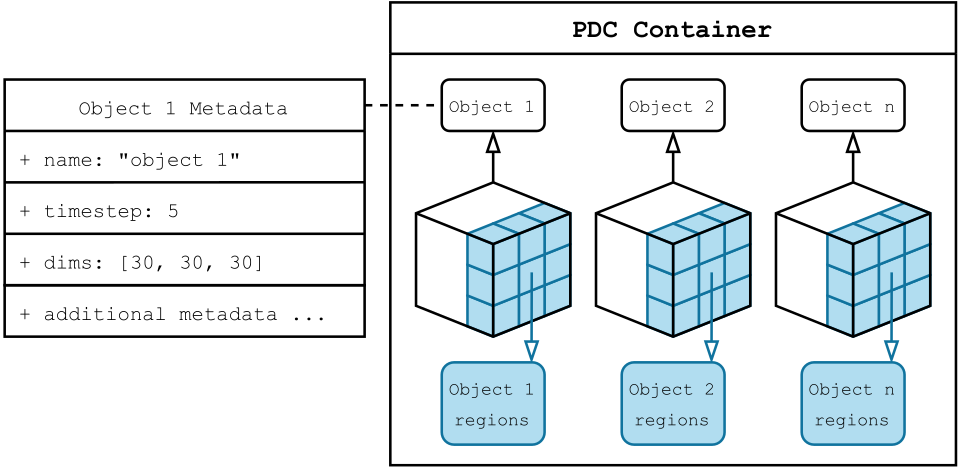

.. _core_concepts:

**2.** Core Concepts
====================

**2.1.** Architecture of PDC
----------------------------

PDC is built on a distributed client-server architecture optimized for 
high-performance computing (HPC) environments. In this model, clients 
are user processes that interact with the PDC client library and API 
to initiate data creation, movement, querying, and transformation. 
Servers are background processes that carry out these operations as 
requested by the clients. Communication between clients and servers 
is handled via Mercury RPCs and, when enabled, MPI. This architecture 
supports scalable, asynchronous, and metadata-rich operations that decouple 
the data model from physical data location.

Data Management and Movement
~~~~~~~~~~~~~~~~~~~~~~~~~~~~

PDC manages both data and metadata in a way that optimizes movement across 
deep memory hierarchies. Data is stored in objects and moved asynchronously 
through region-based APIs, while metadata is distributed and indexed to support 
scalable querying. Key features of this model include asynchronous data transfers, 
region-aware memory binding, and automatic coordination between memory and 
storage locations.

**2.2.** PDC abstractions
-------------------------

PDC provides several core abstractions for modeling and managing data.

   Relationship between PDC containers, objects, and regions.

Containers
~~~~~~~~~~

- Logical groupings of related data objects, similar to folders or directories  
- Associated with metadata such as creation time and persistance

Objects
~~~~~~~

- Represent a combination of raw data and descriptive metadata  
- Structured as multidimensional arrays (e.g., 1D, 2D, or 3D) to support scientific data layouts
- Can be queried, updated, and transferred without referencing physical storage directly  

Regions
~~~~~~~

- Represent the fundamental unit of data access in PDC  
- Defined as sub-sections within an object  
- Defined as multidimensional sub-sections within an object  
- Used to read or write portions of data during transfers  

.. note::
   PDC currently supports a maximum of 3 dimensions for both objects and regions.

**2.3.** Properties
-------------------

Properties determine how objects, containers, etc., behave. 
A property list is created using ``PDCprop_create(x)``, where ``x`` is 
the entity type (``PDC_CONTAINER``, ``PDC_OBJ``, etc.). Once created, the 
property list can be configured through additional function calls that 
append or modify properties. These customized property lists can then be 
used in later calls to control the behavior of the associated entities. Some 
examples of configurable properties are shown below.

Container Properties
~~~~~~~~~~~~~~~~~~~~

Container properties define key attributes that determine the behavior and 
lifecycle of containers within the system. These properties are typically 
specified at container creation time and can be queried or modified via 
container-related functions.

- **Lifetime**  
  Containers can be created with a specified lifetime, such as *persistent* or *transient*. 
  Persistent containers remain accessible across multiple sessions, whereas transient containers 
  exist only for the duration of a program’s execution.

- **Creation and Opening**  
  Containers can be created and opened either individually or collectively (across multiple ranks), 
  enabling both independent and coordinated container management.

- **Information and Iteration**  
  Once created or opened, container properties and metadata can be retrieved through information 
  query functions. Containers can also be iterated over to discover all containers within a 
  given context.

- **Persistence Control**  
  Transient containers can be explicitly persisted to extend their lifetime beyond the current execution.

- **Initialization and Finalization**  
  The container subsystem provides explicit initialization and finalization calls to manage resources properly.

Object Properties
~~~~~~~~~~~~~~~~~

Object properties characterize the essential attributes and behavior of objects managed within containers. 
These properties define the shape, type, location, and metadata associated with an object, enabling 
precise control over how the object is created, accessed, and managed.

- **Initialization and Creation**  
  Objects are initialized within a container context and can be created either locally or collectively, 
  allowing flexibility in parallel or distributed environments.

- **Data Type and Dimensionality**  
  Properties specify the variable type of the object data (such as integer or float) as well as its 
  dimensions, which can include fixed sizes or support for unlimited dimensions.

- **Metadata and Tags**  
  Objects can carry associated metadata such as user IDs, application names, time steps, data 
  location paths, and user-defined tags to facilitate identification and management.

- **Consistency and Partitioning**  
  Properties include options to define consistency semantics and data transfer partitioning 
  strategies, helping optimize performance and correctness in concurrent access scenarios.

- **Buffers and Caching**  
  Objects can be linked with data buffers, and explicit control over cache flushing is 
  supported to ensure data integrity and synchronization.

- **Lifecycle and Management**  
  Object properties support lifecycle operations such as opening, closing, iterating over 
  multiple objects within a container, and deleting objects when no longer needed.

- **Query and Modification**  
  Functions allow querying and modifying object properties and dimensions dynamically, supporting 
  evolving data and usage patterns.

**2.4.** Data Acess Lifecycle 
-----------------------------

The typical workflow for interacting with PDC objects is described below.

Object Creation  
~~~~~~~~~~~~~~~

1. Define object properties (datatype, size, etc.).
2. Create or select a container.
3. Call PDCobj_create() to allocate the object with metadata.

Allocation of Regions & Containers
~~~~~~~~~~~~~~~~~~~~~~~~~~~~~~~~~~

1. Use PDCregion_create() to define the region to write or read from.
2. The region is tied to an object and a memory location.
3. Multiple regions can be created for batch or parallel operations.

Asynchronous & Synchronous Data Transfers  
~~~~~~~~~~~~~~~~~~~~~~~~~~~~~~~~~~~~~~~~~

**Asynchronous**

1. Initiated using PDCbuf_obj_map() 
2. Completion checked with PDCregion_transfer_start() and PDCregion_transfer_wait()
3. Enables overlapping of computation and communication

**Synchronous**

1. Blocking operations that ensure data is transferred before proceeding
2. Useful for simple or sequential workflows

Finalization
~~~~~~~~~~~~

Once all of the operations are completed:

1. Call PDCobj_close() and PDCcont_close() to release all handles 
2. Use PDCclose() to clean up the PDC environment 
3. Ensure that all resources have been flushed and deallocated