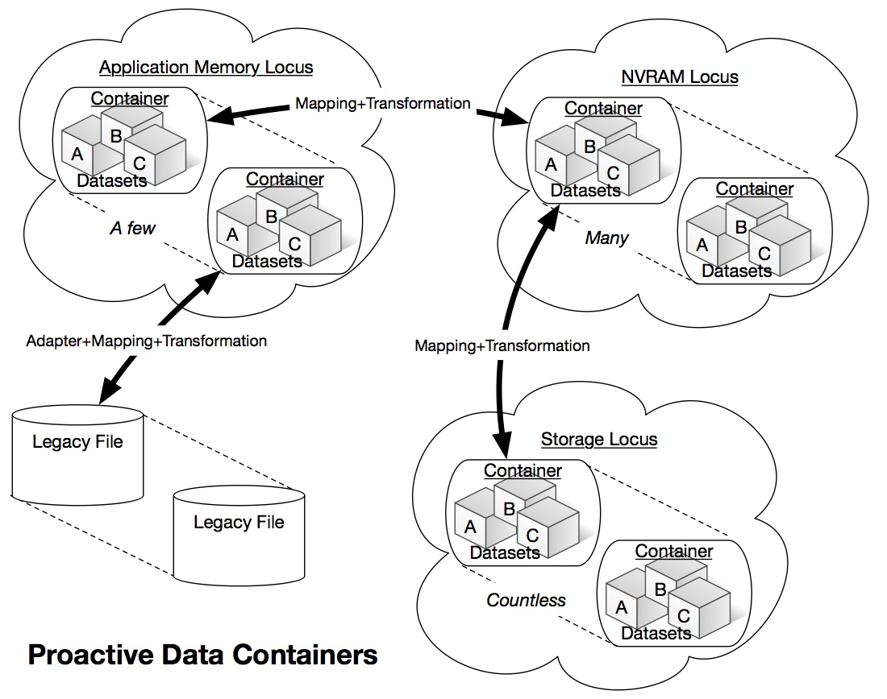

================================
Introduction
================================

Emerging high performance computing (HPC) systems are expected to be deployed with an unprecedented level of complexity, due to a very deep system memory/storage hierarchy. This hierarchy is expected to range from CPU cache through several levels of volatile memory to non-volatile memory, traditional hard disks, and tape. Simple and efficient methods of data management and movement through this hierarchy is critical for scientific applications using exascale systems. Existing storage system and I/O (SSIO) technologies face severe challenges in dealing with these requirements. POSIX and MPI I/O standards that are the basis for existing I/O libraries and parallel file systems present fundamental challenges in the areas of scalable metadata operations, semantics-based data movement performance tuning, asynchronous operation, and support for scalable consistency of distributed operations.

Moving toward new paradigms for SSIO in the extreme-scale era, we propose to investigate novel object- based data abstractions and storage mechanisms that take advantage of the deep storage hierarchy and enable proactive automated performance tuning. In order to achieve these overarching goals, we propose a fundamental new data abstraction, called Proactive Data Containers (PDC). A PDC is a container within a locus of storage (memory, NVRAM, disk, etc.) that stores science data in an object-oriented manner. Managing data as objects enables powerful optimization opportunities for data movement and transformations. In this project, we will research: 1) formulation of object-oriented PDCs and their mapping in different levels of the exascale storage hierarchy; 2) efficient strategies for moving data in deep storage hierarchies using PDCs; 3) techniques for transforming and reorganizing data based on application requirements; and 4) novel analysis paradigms for enabling data transformations and user-defined analysis on data in PDCs. The intent of our research is to move the field of HPC SSIO in a direction where it may ultimately be possible to develop scientific applications without the need to perform cumbersome and inefficient tuning to optimize data movement on every system the application runs on.

PDCs will have an impact in many science areas, given the importance of the data management and I/O software stack in achieving science discoveries at scale. The foundations of the novel data management and storage paradigm approaches and formalisms proposed in this research are expected to be applicable to a broad range of scientific and engineering problems that utilize computational and experimental facilities for predictive understanding of physical processes through data analytics and visualization. The proposed techniques are expected to accelerate the crucial process of data-driven exploration and knowledge discovery. While we will work closely with a set of key DOE science applications in the areas of cosmology, climate, genomics, and high-energy density physics to evaluate our research, the proposed new I/O paradigm will be broadly applicable to all users of DOE HPC facilities.